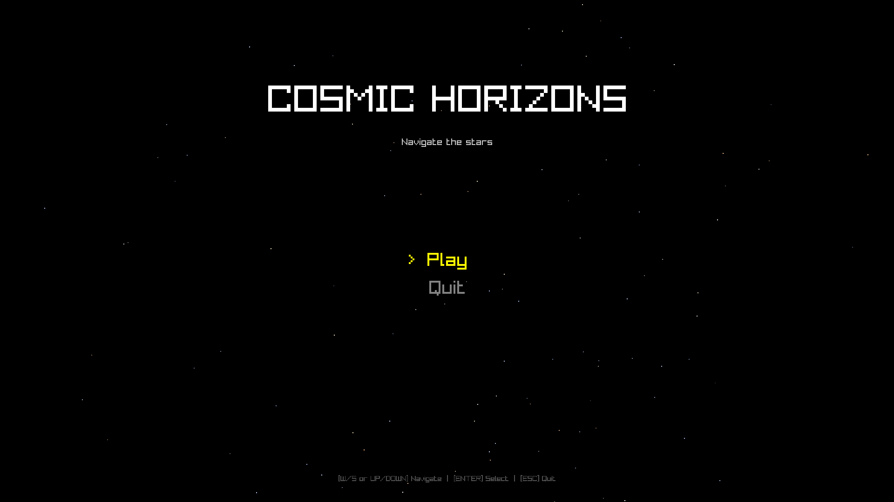
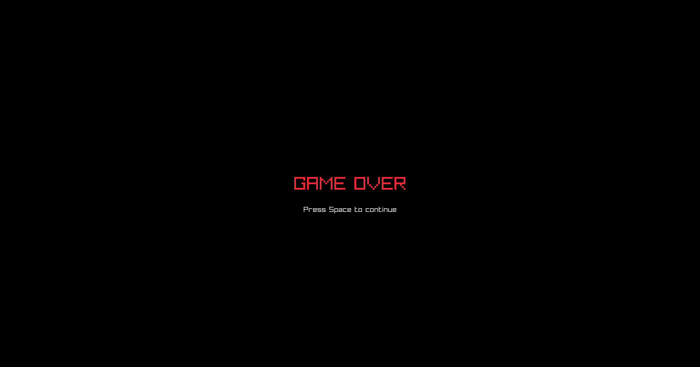
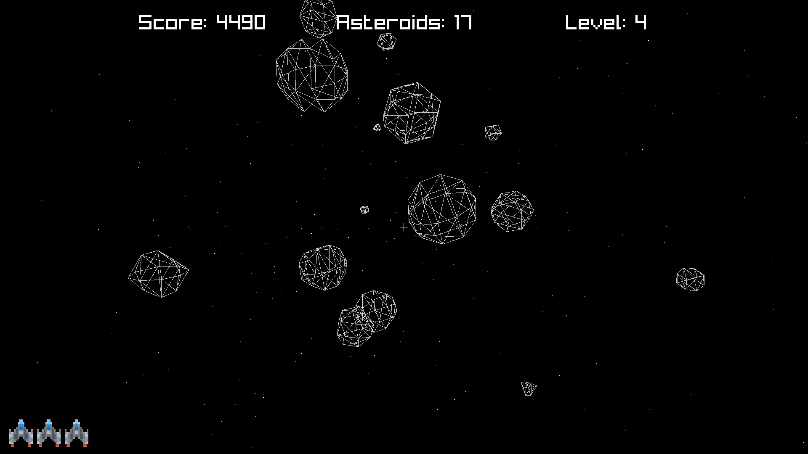
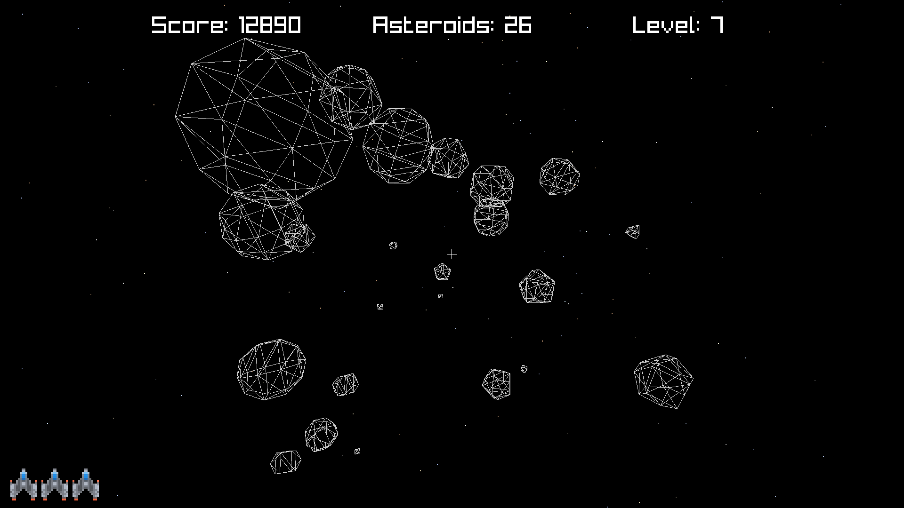
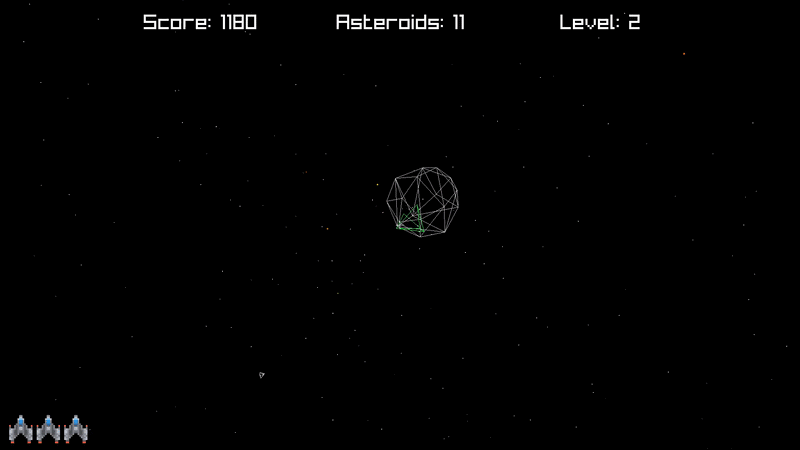

# Cosmic Horizons

> Navigate the cosmos, dodge asteroids, and shoot your way through space.

**Cosmic Horizons** is a 3D first-person space shooter built with C++20 and [Raylib](https://www.raylib.com/). Pilot your spaceship through an asteroid field, destroy targets to rack up points, and survive as long as you can.

## Screenshots

<div align="center">
  
  
  <br/>
  
  
  <br/>
  
</div>

## Features

- **6DOF spaceship movement** — pitch, yaw, and roll through open space
- **Asteroid shooting** — aim with the crosshair and fire with raycasting-based hit detection
- **Score & accuracy tracking** — monitor your performance in real time
- **Lives system** — 3 lives per run; collide with an asteroid and you lose one
- **Procedural asteroids** — randomly generated shapes, sizes, and trajectories
- **Starfield background** — parallax star rendering for immersion
- **Sound effects** — shooting and destruction audio feedback

## Controls

| Action | Input |
|--------|-------|
| Aim / Look | Mouse |
| Move Up | `W` |
| Move Down | `S` |
| Roll Left | `A` |
| Roll Right | `D` |
| Shoot | Left Click |
| Quit | `ESC` |

## Building

### Prerequisites

- **CMake** 3.28 or higher
- A **C++20** compatible compiler (GCC 13+, Clang 16+, MSVC 2022+)
- **Git** (for submodules)

### Steps

```bash
# Clone with submodules
git clone --recursive https://github.com/pablobh2147/Cosmic-Horizons.git
cd cosmic-horizons

# Configure and build
cmake -B build -DCMAKE_BUILD_TYPE=Release
cmake --build build

# Run
./build/CosmicHorizons
```

### Cross-Compilation for Windows (Linux)

A convenience script is provided for cross-compiling the Windows executable from Linux using MinGW-w64:

```bash
# Build the Windows executable
./build-windows.sh
```

**Prerequisites:** `mingw-w64` toolchain (`x86_64-w64-mingw32-gcc` / `x86_64-w64-mingw32-g++`).

The Windows executable will be output to `build-windows/CosmicHorizons.exe`.

## Packaging

A `package.sh` script is included to generate distribution packages for both platforms. It copies the Linux and Windows executables (along with the `assets/` directory) into `package/linux/` and `package/windows/` respectively, then creates ZIP archives:

```bash
./package.sh
```

**Output:**
- `package/CosmicHorizons-linux.zip`
- `package/CosmicHorizons-windows.zip`

> **Note:** The `package/` directory is gitignored.

## Dependencies

| Library | Purpose | Included as |
|---------|---------|-------------|
| [Raylib](https://github.com/raysan5/raylib) | Rendering, input, audio | Git submodule |
| [GLM](https://github.com/g-truc/glm) | Math (vectors, matrices, quaternions) | Git submodule |

## License

This project is licensed under the **GNU General Public License v3.0** — see the [LICENSE](LICENSE) file for details.

## Credits

See [CREDITS.md](CREDITS.md) for full attribution of assets and contributors.
